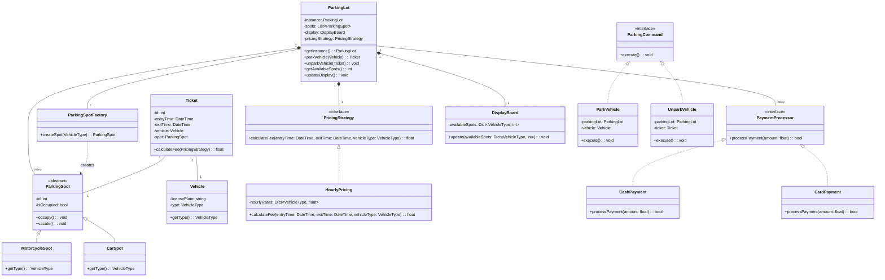

# Design a Parking Lot System

## System Requirements

1. The parking lot consists of a single floor with multiple parking spots.
2. Parking spots are categorized into two types: motorcycle spots and car spots.
3. Each category has a fixed hourly rate.
4. The system must track and display real-time availability of parking spots for each category.
5. Upon entry, the system issues a ticket with entry time and vehicle type.
6. Upon exit, the system calculates the parking fee based on the duration of stay and vehicle type.
7. Payment options include cash and card.
8. The system controls entry and exit barriers.

**Interviewer Feedback**: 
These requirements provide a good starting point for a basic parking lot system. However, we should consider a few additional points:

- Is there a maximum time limit for parking?
- How will the system handle lost tickets?


## OOP-Design

### How to Think About Converting System Requirements to OOP Design:

1. Identify the main entities (nouns) in the requirements:
   Look for nouns in the requirements that represent key concepts or objects in the system. These often become your main classes.

2. Identify actions or behaviors (verbs):
   Look for verbs that describe what the system or entities do. These often become methods in your classes.

3. Determine relationships:
   Think about how the entities relate to each other. This helps in establishing relationships between classes (e.g., association, composition, inheritance).

4. Consider attributes:
   For each entity, think about what properties or data it should have. These become attributes (fields) in your classes.

5. Think about encapsulation:
   Determine what information should be private to a class and what should be accessible from outside.

6. Consider inheritance and interfaces:
   Look for commonalities between entities that might benefit from inheritance or interface implementation.

7. Think about the Single Responsibility Principle:
   Ensure each class has a single, well-defined purpose.

Now, let's apply this thinking to your parking lot system requirements:

### OOP Design for the Parking Lot System:

1. Main Classes:

   a. ParkingLot
      - Attributes:
        - capacity (for each vehicle type)
        - currentOccupancy (for each vehicle type)
      - Methods:
        - checkAvailability()
        - updateOccupancy()
        - displayAvailability()

   b. ParkingSpot
      - Attributes:
        - spotId
        - type (car or motorcycle)
        - isOccupied
      - Methods:
        - occupy()
        - vacate()

   c. Vehicle
      - Attributes:
        - licensePlate
        - type (car or motorcycle)

   d. Ticket
      - Attributes:
        - ticketId
        - entryTime
        - vehicleType
        - paymentStatus
      - Methods:
        - calculateFee()
        - markAsPaid()

   e. ParkingRate
      - Attributes:
        - vehicleType
        - hourlyRate
      - Methods:
        - getRate()

   f. PaymentProcessor
      - Methods:
        - processCashPayment()
        - processCardPayment()

   g. DisplayBoard
      - Methods:
        - updateDisplay()

2. Relationships:

   - ParkingLot has multiple ParkingSpots (composition)
   - ParkingLot has one DisplayBoard (composition)
   - ParkingLot uses ParkingRate to calculate fees
   - Ticket is associated with one Vehicle
   - Ticket is associated with one ParkingSpot
   - PaymentProcessor is used by ParkingLot to handle payments

3. Additional Considerations:

   - We might want to create an abstract Vehicle class and then have Car and Motorcycle classes inherit from it.
   - We could create an interface IPaymentMethod with methods like processPayment(), which could be implemented by different payment methods (cash, card) in the future.


#### More Detailed (Optional)


Here's a breakdown of the key elements:

1. Abstract Classes and Inheritance:
   - `Vehicle` is an abstract class, with `Car` and `Motorcycle` inheriting from it.

2. Interfaces and Strategy Pattern:
   - `ParkingRateStrategy` is an interface, implemented by `HourlyRateStrategy`.
   - `PaymentProcessor` is an interface, implemented by `CashPayment` and `CardPayment`.

3. Composition and Association:
   - `ParkingLot` has a composition relationship with `ParkingSpot` and `DisplayBoard`.
   - `ParkingLot` has an association with `ParkingRateStrategy` and `PaymentProcessor`.

4. Enums:
   - `VehicleType` is represented as an enumeration.

5. Key Methods and Attributes:
   - Each class includes its most important attributes and methods.

6. Relationships:
   - Various relationship types (composition, association, inheritance) are represented using different arrow types.

## Code Implementation

```python
# File: parking_lot.py
from typing import List, Dict
from datetime import datetime
from abc import ABC, abstractmethod

class VehicleType:
    MOTORCYCLE = "motorcycle"
    CAR = "car"

class ParkingLot:
    _instance = None

    def __init__(self):
        self.spots: List[ParkingSpot] = []
        self.display: DisplayBoard = DisplayBoard()
        self.pricing_strategy: PricingStrategy = HourlyPricing()
        self.spot_factory: ParkingSpotFactory = ParkingSpotFactory()

    @classmethod
    def get_instance(cls):
        if cls._instance is None:
            cls._instance = cls()
        return cls._instance

    def park_vehicle(self, vehicle: 'Vehicle') -> 'Ticket':
        available_spot = next((spot for spot in self.spots if not spot.is_occupied and spot.get_type() == vehicle.get_type()), None)
        if available_spot:
            available_spot.occupy()
            ticket = Ticket(vehicle, available_spot)
            self.update_display()
            return ticket
        raise Exception("No available parking spots for this vehicle type.")

    def unpark_vehicle(self, ticket: 'Ticket') -> float:
        ticket.exit_time = datetime.now()
        fee = ticket.calculate_fee(self.pricing_strategy)
        ticket.spot.vacate()
        self.update_display()
        return fee

    def update_display(self):
        available_spots = {
            VehicleType.MOTORCYCLE: sum(1 for spot in self.spots if not spot.is_occupied and spot.get_type() == VehicleType.MOTORCYCLE),
            VehicleType.CAR: sum(1 for spot in self.spots if not spot.is_occupied and spot.get_type() == VehicleType.CAR)
        }
        self.display.update(available_spots)

# File: parking_spot.py
class ParkingSpot(ABC):
    def __init__(self, spot_id: int):
        self.id = spot_id
        self.is_occupied = False

    def occupy(self):
        self.is_occupied = True

    def vacate(self):
        self.is_occupied = False

    @abstractmethod
    def get_type(self) -> str:
        pass

class MotorcycleSpot(ParkingSpot):
    def get_type(self) -> str:
        return VehicleType.MOTORCYCLE

class CarSpot(ParkingSpot):
    def get_type(self) -> str:
        return VehicleType.CAR

class ParkingSpotFactory:
    def create_spot(self, vehicle_type: str, spot_id: int) -> ParkingSpot:
        if vehicle_type == VehicleType.MOTORCYCLE:
            return MotorcycleSpot(spot_id)
        elif vehicle_type == VehicleType.CAR:
            return CarSpot(spot_id)
        else:
            raise ValueError("Invalid vehicle type")

# File: vehicle.py
class Vehicle:
    def __init__(self, license_plate: str, vehicle_type: str):
        self.license_plate = license_plate
        self.type = vehicle_type

    def get_type(self) -> str:
        return self.type

# File: ticket.py
class Ticket:
    def __init__(self, vehicle: Vehicle, spot: ParkingSpot):
        self.id = id(self)
        self.entry_time = datetime.now()
        self.exit_time = None
        self.vehicle = vehicle
        self.spot = spot

    def calculate_fee(self, pricing_strategy: 'PricingStrategy') -> float:
        return pricing_strategy.calculate_fee(self.entry_time, self.exit_time, self.vehicle.get_type())

# File: pricing_strategy.py
class PricingStrategy(ABC):
    @abstractmethod
    def calculate_fee(self, entry_time: datetime, exit_time: datetime, vehicle_type: str) -> float:
        pass

class HourlyPricing(PricingStrategy):
    def __init__(self):
        self.hourly_rates = {
            VehicleType.MOTORCYCLE: 1.0,
            VehicleType.CAR: 2.0
        }

    def calculate_fee(self, entry_time: datetime, exit_time: datetime, vehicle_type: str) -> float:
        duration = (exit_time - entry_time).total_seconds() / 3600  # Convert to hours
        return duration * self.hourly_rates[vehicle_type]

# File: payment_processor.py
class PaymentProcessor(ABC):
    @abstractmethod
    def process_payment(self, amount: float) -> bool:
        pass

class CashPayment(PaymentProcessor):
    def process_payment(self, amount: float) -> bool:
        print(f"Processing cash payment of ${amount:.2f}")
        return True

class CardPayment(PaymentProcessor):
    def process_payment(self, amount: float) -> bool:
        print(f"Processing card payment of ${amount:.2f}")
        return True

# File: display_board.py
class DisplayBoard:
    def __init__(self):
        self.available_spots: Dict[str, int] = {}

    def update(self, available_spots: Dict[str, int]):
        self.available_spots = available_spots
        self._display()

    def _display(self):
        print("Available Parking Spots:")
        for vehicle_type, count in self.available_spots.items():
            print(f"{vehicle_type.capitalize()}: {count}")

# File: parking_command.py
class ParkingCommand(ABC):
    @abstractmethod
    def execute(self):
        pass

class ParkVehicle(ParkingCommand):
    def __init__(self, parking_lot: ParkingLot, vehicle: Vehicle):
        self.parking_lot = parking_lot
        self.vehicle = vehicle

    def execute(self):
        return self.parking_lot.park_vehicle(self.vehicle)

class UnparkVehicle(ParkingCommand):
    def __init__(self, parking_lot: ParkingLot, ticket: Ticket):
        self.parking_lot = parking_lot
        self.ticket = ticket

    def execute(self):
        return self.parking_lot.unpark_vehicle(self.ticket)

# File: main.py
def main():
    parking_lot = ParkingLot.get_instance()
    
    # Initialize parking spots
    for i in range(50):
        spot = parking_lot.spot_factory.create_spot(VehicleType.CAR, i)
        parking_lot.spots.append(spot)
    for i in range(50, 100):
        spot = parking_lot.spot_factory.create_spot(VehicleType.MOTORCYCLE, i)
        parking_lot.spots.append(spot)

    # Update initial display
    parking_lot.update_display()

    # Simulate parking and unparking
    car = Vehicle("ABC123", VehicleType.CAR)
    park_command = ParkVehicle(parking_lot, car)
    ticket = park_command.execute()
    print(f"Car parked. Ticket ID: {ticket.id}")

    # Simulate some time passing
    import time
    time.sleep(2)

    unpark_command = UnparkVehicle(parking_lot, ticket)
    fee = unpark_command.execute()
    print(f"Car unparked. Fee: ${fee:.2f}")

    # Process payment
    payment_processor = CardPayment()
    if payment_processor.process_payment(fee):
        print("Payment successful")
    else:
        print("Payment failed")

if __name__ == "__main__":
    main()
```
