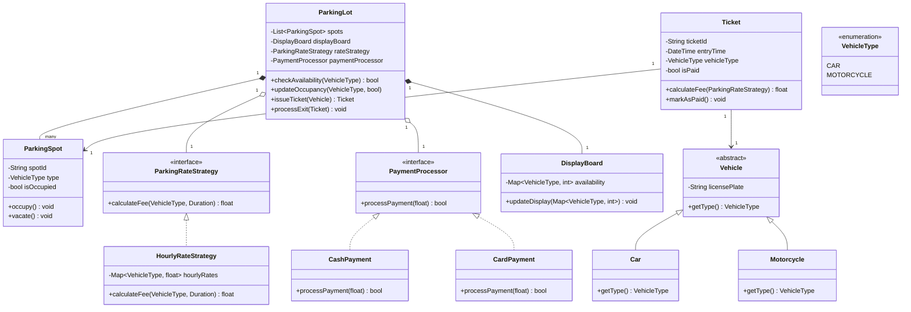

# Design a Parking Lot System

## System Requirements

1. The parking lot consists of a single floor with multiple parking spots.
2. Parking spots are categorized into two types: motorcycle spots and car spots.
3. Each category has a fixed hourly rate.
4. The system must track and display real-time availability of parking spots for each category.
5. Upon entry, the system issues a ticket with entry time and vehicle type.
6. Upon exit, the system calculates the parking fee based on the duration of stay and vehicle type.
7. Payment options include cash and card.
8. The system controls entry and exit barriers.

** Possible Interviewer Feedback**: 
These requirements provide a good starting point for a basic parking lot system. However, we should consider a few additional points:

- Is there a maximum time limit for parking?
- How will the system handle lost tickets?

## OOP-Design

### How to Think About Converting System Requirements to OOP Design:

1. Identify the main entities (nouns) in the requirements:
   Look for nouns in the requirements that represent key concepts or objects in the system. These often become your main classes.

2. Identify actions or behaviors (verbs):
   Look for verbs that describe what the system or entities do. These often become methods in your classes.

3. Determine relationships:
   Think about how the entities relate to each other. This helps in establishing relationships between classes (e.g., association, composition, inheritance).

4. Consider attributes:
   For each entity, think about what properties or data it should have. These become attributes (fields) in your classes.

5. Think about encapsulation:
   Determine what information should be private to a class and what should be accessible from outside.

6. Consider inheritance and interfaces:
   Look for commonalities between entities that might benefit from inheritance or interface implementation.

7. Think about the Single Responsibility Principle:
   Ensure each class has a single, well-defined purpose.

Now, let's apply this thinking to your parking lot system requirements:

### OOP Design for the Parking Lot System:

1. Main Classes:

   a. ParkingLot
      - Attributes:
        - capacity (for each vehicle type)
        - currentOccupancy (for each vehicle type)
      - Methods:
        - checkAvailability()
        - updateOccupancy()
        - displayAvailability()

   b. ParkingSpot
      - Attributes:
        - spotId
        - type (car or motorcycle)
        - isOccupied
      - Methods:
        - occupy()
        - vacate()

   c. Vehicle
      - Attributes:
        - licensePlate
        - type (car or motorcycle)

   d. Ticket
      - Attributes:
        - ticketId
        - entryTime
        - vehicleType
        - paymentStatus
      - Methods:
        - calculateFee()
        - markAsPaid()

   e. ParkingRate
      - Attributes:
        - vehicleType
        - hourlyRate
      - Methods:
        - getRate()

   f. PaymentProcessor
      - Methods:
        - processCashPayment()
        - processCardPayment()

   g. DisplayBoard
      - Methods:
        - updateDisplay()

2. Relationships:

   - ParkingLot has multiple ParkingSpots (composition)
   - ParkingLot has one DisplayBoard (composition)
   - ParkingLot uses ParkingRate to calculate fees
   - Ticket is associated with one Vehicle
   - Ticket is associated with one ParkingSpot
   - PaymentProcessor is used by ParkingLot to handle payments

#### More Detailed (Optional)

Here's a breakdown of the key elements:

1. Abstract Classes and Inheritance:
   - `Vehicle` is an abstract class, with `Car` and `Motorcycle` inheriting from it.

2. Interfaces and Strategy Pattern:
   - `ParkingRateStrategy` is an interface, implemented by `HourlyRateStrategy`.
   - `PaymentProcessor` is an interface, implemented by `CashPayment` and `CardPayment`.

3. Composition and Association:
   - `ParkingLot` has a composition relationship with `ParkingSpot` and `DisplayBoard`.
   - `ParkingLot` has an association with `ParkingRateStrategy` and `PaymentProcessor`.

4. Enums:
   - `VehicleType` is represented as an enumeration.

5. Key Methods and Attributes:
   - Each class includes its most important attributes and methods.

6. Relationships:
   - Various relationship types (composition, association, inheritance) are represented using different arrow types.
